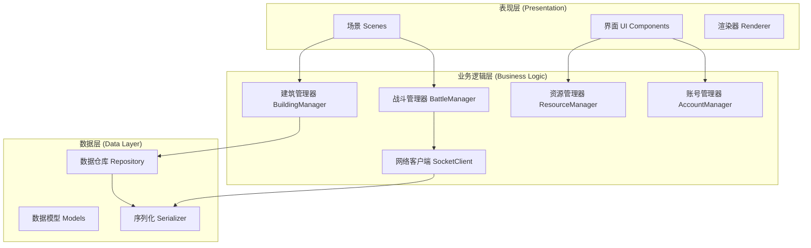

# ⚔️ Clash of Clans - 程序设计范式期末项目


> 基于 **Cocos2d-x 4.0** 开发的塔防策略游戏，支持本地多账号管理、Socket 网络通信、实时 PVE/PVP 对战及战斗回放功能。

---

## 🛠️ 项目环境

### 开发工具

| 工具 | 版本要求 | 备注 |
| :--- | :--- | :--- |
|  | **2022** | Windows 开发环境 |
|  | **2025.2.2** | Android 打包与调试 |
| **CMake** | **3.10** | 构建工具 |
| **NDK** | **r19c** | 版本号 19.2.5345600 |

### 技术栈

| 模块 | 技术选型 | 版本/配置 |
| :--- | :--- | :--- |
| **引擎核心** | Cocos2d-x | 4.0 (基于 C++17) |
| **构建系统** | Gradle | 8.0 (AGP 7.4.2) |
| **网络通信** | BSD Socket | TCP / Blocking Mode |
| **数据交换** | RapidJSON | JSON 序列化 |
| **脚本/配置** | Python | 2.7 (Cocos 命令行依赖) |

### Android 配置 (`app/build.gradle`)

```gradle
android {
    compileSdkVersion 33
    minSdkVersion 19
    targetSdkVersion 33
    ndkVersion "19.2.5345600"

    defaultConfig {
        externalNativeBuild {
            cmake {
                // 关键编译参数
                arguments "-DCMAKE_FIND_ROOT_PATH=",
                          "-DANDROID_STL=c++_static",
                          "-DANDROID_TOOLCHAIN=clang",
                          "-DANDROID_ARM_NEON=TRUE",
                          "-j8"
            }
        }
    }
}
```

---

## 项目结构

```text
coc/
├── Classes/                      # 核心代码逻辑
│   ├── Buildings/                # 建筑系统 (Base, TownHall, Defense...)
│   ├── Unit/                     # 单位系统 (Base, CombatStats, Types...)
│   ├── Managers/                 # 管理器 (Account, Building, Battle, Resource...)
│   ├── Scenes/                   # 场景 (Login, Map, Battle)
│   ├── UI/                       # 界面组件 (HUD, Shop, Settings)
│   └── Services/                 # 服务层 (Upgrade, Clan)
├── Server/                       # 服务器端代码 (C++ Socket)
├── Resources/                    # 游戏资源 (图片, 字体, 声音, 地图)
│   ├── buildings/
│   ├── units/
│   └── map/
├── proj.win32/                   # Windows 工程文件
├── proj.android/                 # Android 工程文件
└── CMakeLists.txt                # CMake 构建配置
```

---

## 🚀 编译与运行

### 💻 Windows 平台

1.  **打开项目**：进入 `proj.win32` 目录，双击 `HelloCpp.sln`。
2.  **配置**：在 Visual Studio 中选择 **Debug** 或 **Release** 以及 **x86**。
3.  **编译服务器**：右键 `Server` 项目 -> **生成**。
    * 运行：`proj.win32/bin/Server/Release/Server.exe`
4.  **运行客户端**：右键 `HelloCpp` 项目 -> **设为启动项目** -> **F5**。

### 🤖 Android 平台

1.  **打开项目**：启动 Android Studio，选择 `Open`，指向 `proj.android` 目录。
2.  **同步**：等待 Gradle Sync 完成（如网络不通请配置代理）。
3.  **部署**：连接真机或启动模拟器，点击顶部绿色的 **Run** 按钮。

---

## 核心功能模块

### 🏰 1. 建筑系统 (Building System)
* **多类型支持**：大本营 (Lv.17)、资源设施、防御塔、兵营、城墙 (Lv.16)。
* **交互逻辑**：支持拖拽放置、点击升级、长按移动、回收删除。
* **工人机制**：基于工人数量的并行升级队列管理。

### 💰 2. 资源系统 (Economy)
* **产出与存储**：金矿/圣水收集器生产，金库/圣水瓶存储。
* **动态计算**：基于大本营等级和存储建筑等级动态计算容量上限。
* **动画反馈**：点击收集时的资源飞入动画。

### ⚔️ 3. 战斗与对战 (Battle System)
* **双模式**：
    * **PVE**：单机挑战 AI 或离线玩家镜像。
    * **PVP**：(实验性) 在线实时 Socket 对战。
* **智能 AI**：基于 A* 寻路的自动索敌、攻击判定、城墙破坏逻辑。
* **结算体系**：0-3 星评级、摧毁百分比、资源掠夺量、奖杯升降。

### 🌐 4. 网络与多人 (Network & Multiplayer)
* **Socket 通信**：自定义 TCP 协议，支持多线程并发处理。
* **部落功能**：创建部落、成员管理、部落战匹配。
* **数据同步**：玩家数据云端/本地双重备份，支持多设备登录。

### 📹 5. 高级特性
* **回放系统**：采用**指令序列化**技术，完美重现整场战斗过程（下兵位置、时机）。
* **防守日志**：记录离线期间的被攻击记录，支持一键复仇或回放。
* **多账号**：本地支持无缝切换多个游戏账号，数据完全隔离。

---

## 📡 网络通信协议

项目采用自定义的 **包头 + 包体** 二进制协议。

### 协议结构
```cpp
struct PacketHeader {
    uint32_t type;      // 消息 ID
    uint32_t length;    // 包体长度
};
```

### 常用消息 ID
| ID | 宏定义 | 方向 | 描述 |
| :--- | :--- | :--- | :--- |
| **1** | `PACKET_LOGIN` | C → S | 身份验证与登录 |
| **2** | `PACKET_UPLOAD_MAP` | C → S | 同步本地地图数据 |
| **10** | `PACKET_FIND_MATCH` | C → S | 请求 PVP 匹配 |
| **13** | `PACKET_ATTACK_START` | C → S | 发送攻击指令 |
| **14** | `PACKET_ATTACK_RESULT` | C ↔ S | 战斗结算与回放数据 |

---

## 💾 数据持久化模型

数据存储采用 JSON 格式，路径如下：
* **Win32**: `%LOCALAPPDATA%\HelloCpp\`
* **Android**: `/data/data/org.cocos2dx.hellocpp/files/`

```json
{
  "userId": "player_1001",
  "resources": {
    "gold": 15000,
    "elixir": 23000,
    "gems": 50
  },
  "buildings": [
    { "id": 1, "type": "TownHall", "level": 5, "x": 20, "y": 20 },
    { "id": 2, "type": "Cannon", "level": 3, "x": 24, "y": 18 }
  ]
}
```

---

## 🏗️ 架构设计

项目采用分层架构设计，确保逻辑与表现分离。



---

## ❓ 常见问题 (FAQ)

<details>
<summary><strong>Q: 编译时提示 NDK 版本错误？</strong></summary>

> 请确保在 Android Studio 的 SDK Tools 中勾选 "Show Package Details"，并下载版本 **19.2.5345600**。
</details>

<details>
<summary><strong>Q: 运行后无法连接服务器？</strong></summary>

> 1. 确保 `Server.exe` 正在运行且未被防火墙拦截。
> 2. 如果是模拟器运行，请将连接 IP 改为 `10.0.2.2`。
> 3. 真机调试请确保手机与电脑在同一局域网，并填写电脑的局域网 IP。
</details>

<details>
<summary><strong>Q: 游戏内文字显示方块或乱码？</strong></summary>

> 检查 `Resources/fonts/` 下的 TTF 字体文件是否完整，且代码中引用的字体名称是否正确。
</details>

---

## 许可证

本项目采用 [MIT License](LICENSE) 进行许可。